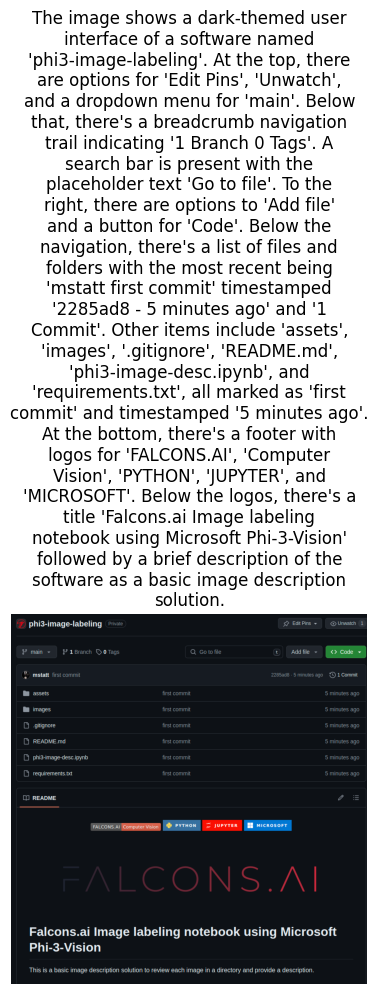

<div id="top"></div>
<div align="center">

[](https://shields.io/)


</div>


<!-- PROJECT LOGO -->
<br />
<div align="center">
    
</div>


# Falcons.ai Image labeling notebook using Microsoft Phi-3-Vision

This is a basic image description solution to review each image in a directory and provide a description.

## Overview
The Image_desc function processes an image and generates a detailed description using the Phi-3 model.


## How it works

- Initially it loops through the images directory loading all found images into a list.

- Then loads the model and processor, either from a pre-downloaded local directory or directly from the Huggingface repository.

- A for loop is initiated on the list of images calling the processing function.

- The function then takes an image path and a prompt as inputs, processes the image, and generates a description. The generated description is displayed using Matplotlib along with the image.


- The response is the description which gets written to a .txt file with the same name as the corresponding image in the images directory.


This function is helpful for generating descriptive tags for a large volume of images.

## Directory Structure
```
Ensure that your data directory contains subfolders named according to each class of images. For example:

images/
    ├── image1.jpg
    ├── image2.jpg
    ├── etc

```


## Installation

To set up the environment, you need to install the following packages:

```sh
pip install flash_attn==2.5.8
pip install numpy==1.24.4
pip install Pillow==10.3.0
pip install Requests==2.31.0
pip install torch==2.3.0
pip install torchvision==0.18.0
pip install transformers==4.40.2
pip install flash_attn
pip install accelerate
pip install tqdn
pip install huggingface_hub
pip install ipywidgets
pip install matplotlib
```


## Usage

```
jupyter notebook phi3-image-desc.ipynb
```


## Results
Image Description #1            |  Image Description #2          |  Image Description #3
:-------------------------:|:-------------------------:|:-------------------------:
  |   |  

## Contributing
Contributions are welcome! If you would like to contribute to this project, please:
1. Fork the repository.
2. Create a new branch (`git checkout -b feature-branch`).
3. Make your changes.
4. Commit your changes (`git commit -m 'Add new feature'`).
5. Push to the branch (`git push origin feature-branch`).
6. Open a pull request.

<!-- LICENSE -->
## License


---
